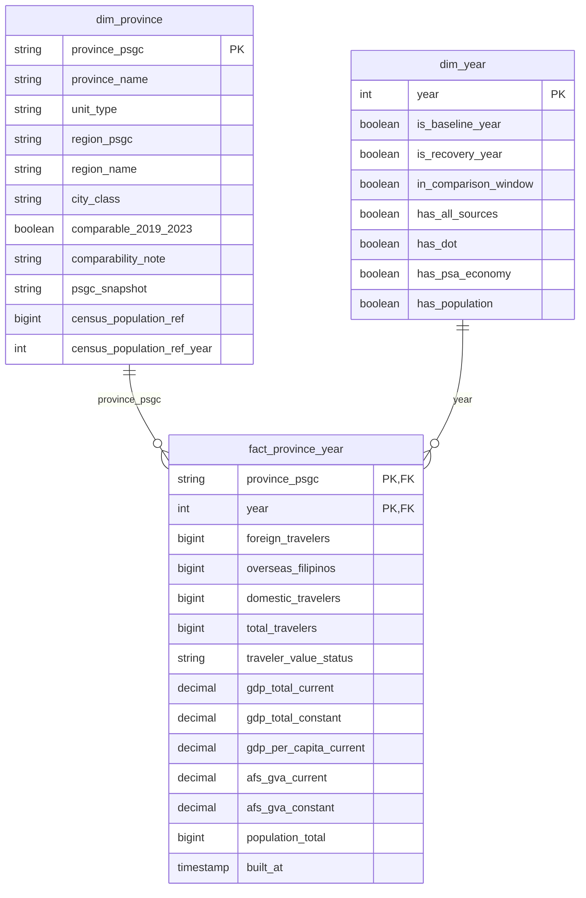

# Province-Level Data Model: Tourism and Local Economy

This document defines the data model that supports the tourism recovery and local-economy business questions (BQ1 and BQ2) at **province level**. It sets out the grain, keys, relationships and important fields of each table; the geographic and temporal compatibility of the sources; the source-to-target mappings; and the decisions taken.

---
## 1. Model overview

**Column definitions (key, column name, data type)**

### dim_province

| Key | Column Name | Data Type |
|-----|-------------|-----------|
| PK | province_psgc | string |
| | province_name | string |
| | unit_type | string |
| | region_psgc | string |
| | region_name | string |
| | city_class | string |
| | comparable_2019_2023 | boolean |
| | comparability_note | string |
| | psgc_snapshot | string |
| | census_population_ref | bigint |
| | census_population_ref_year | int |

### fact_province_year

| Key | Column Name | Data Type |
|-----|-------------|-----------|
| PK, FK | province_psgc | string |
| PK, FK | year | int |
| | foreign_travelers | bigint |
| | overseas_filipinos | bigint |
| | domestic_travelers | bigint |
| | total_travelers | bigint |
| | traveler_value_status | string |
| | gdp_total_current | decimal |
| | gdp_total_constant | decimal |
| | gdp_per_capita_current | decimal |
| | afs_gva_current | decimal |
| | afs_gva_constant | decimal |
| | population_total | bigint |
| | built_at | timestamp |

### dim_year

| Key | Column Name | Data Type |
|-----|-------------|-----------|
| PK | year | int |
| | is_baseline_year | boolean |
| | is_recovery_year | boolean |
| | in_comparison_window | boolean |
| | has_all_sources | boolean |
| | has_dot | boolean |
| | has_psa_economy | boolean |
| | has_population | boolean |

The model is a star schema with one fact table and two dimensions.

| Table | Purpose |
| --- | --- |
| `fact_province_year` | Tourism, economic and population measures for each province-level unit and year |
| `dim_province` | The province-level unit: Philippine Standard Geographic Code (PSGC), name, region and type |
| `dim_year` | The calendar year and flags identifying the baseline and recovery years |

The PSGC gives every place one stable 10-digit code. DOT and PSA identify places by name only, so reviewed mapping tables (kept outside the star) connect their names to PSGC codes. All sources can then be compared for the same province in the same year.

---

## 2. Selected sources

| Source | Bronze table | Used for |
| --- | --- | --- |
| PSGC 2Q 2026, DS_34 main sheet | `psgc_ds_34_psgc` (43,768 rows) | Authoritative list of places and codes; builds `dim_province` |
| PSGC DS_33 Provincial Summary; DS_34 National Summary | `psgc_ds_33_provincial_summary` (139), `psgc_ds_34_national_summary` (22) | Reconciliation only |
| PSGC report text | `psgc_report_text` | Snapshot label |
| DOT DS_05, overnight travelers 2019 to 2024 | `dot_ds_05_<year>` | Tourism columns |
| PSA DS_27 Total GDP, current prices | `psa_ds_27` | `gdp_total_current` |
| PSA DS_28 Total GDP, constant prices | `psa_ds_28` | `gdp_total_constant` |
| PSA DS_26 A&F GVA by region, 2022–2024 | `psa_ds_26` | Reconciliation only (validation rule 6) |
| PSA DS_29 Per capita GDP, current prices | `psa_ds_29` | `gdp_per_capita_current` |
| PSA DS_31 A&F GVA, current prices | `psa_ds_31` | `afs_gva_current` |
| PSA DS_32 A&F GVA, constant prices | `psa_ds_32` | `afs_gva_constant` |
| PSA DS_18 Projected mid-year population | `psa_ds_18` | `population_total` |

Not used: the PSGC `Prov Sum` sheet (dated "as of 30 June 2020") and PSA DS_30, DS_01, DS_02 and DS_08 to DS_17, which no business question requires.

---

## 3. Grain, keys and relationships

| Table | Grain (one row per) | Primary key | Foreign keys |
| --- | --- | --- | --- |
| `fact_province_year` | Province-level unit per year | (`province_psgc`, `year`) | `province_psgc` to `dim_province`; `year` to `dim_year` |
| `dim_province` | Province-level unit | `province_psgc` | none |
| `dim_year` | Calendar year, 2019 to 2024 | `year` | none |

**Relationships.** Each dimension row relates to many fact rows. The fact table joins directly to each dimension; the dimensions do not join to each other.

**Key rules**

1. `province_psgc` holds the PSGC code of the unit (a province code, an HUC city code, or the NCR region code) as 10-character text. Leading zeros are restored where the source has lost them.
2. The 10 digits are structured RR PPP MM BBB: region (digits 1 to 2), province (1 to 5), city or municipality (1 to 7), barangay (1 to 10).
3. The natural PSGC key is used, with no surrogate keys or history tracking, because a single PSGC snapshot applies to all years.
4. The fact table has exactly one row for every unit and every year from 2019 to 2024 (2025 is dropped: only DS_18 covers it). A value that no source published is NULL and is never replaced by 0.

---

## 4. Important fields

### 4.1 `dim_province`

| Field | Description |
| --- | --- |
| `province_psgc` | Primary key |
| `province_name` | Official PSGC name |
| `unit_type` | Province, HUC, Independent city (City of Isabela) or NCR |
| `region_psgc`, `region_name` | Region derived from the unit |
| `city_class` | HUC, independent component city or component city, where relevant |
| `comparable_2019_2023` | True where the unit has the same meaning in the 2019 and 2023 data |
| `comparability_note` | Reason where the unit is not comparable |
| `psgc_snapshot` | `2Q 2026` |
| `census_population_ref`, `census_population_ref_year` | PSGC 2024 census population and its year. This is a fixed census count that describes the unit, not a yearly measurement, so it stays in the dimension. Reference only; never used as a denominator (use `fact_province_year.population_total`) |

### 4.2 `dim_year`

`year`, `is_baseline_year` (2019), `is_recovery_year` (2022, 2023), `in_comparison_window` (2019 to 2023, DL-010), `has_all_sources` (2020 to 2023, when DOT, PSA economy and DS_18 population all exist), `has_dot`, `has_psa_economy`, `has_population`.

### 4.3 `fact_province_year`

| Group | Columns | Source | Additivity |
| --- | --- | --- | --- |
| Tourism | `foreign_travelers`, `overseas_filipinos`, `domestic_travelers`, `total_travelers` | DOT DS_05 | Additive |
| Economy | `gdp_total_current` | PSA DS_27 | Additive |
| | `gdp_total_constant` | PSA DS_28 | Additive within a price basis |
| | `gdp_per_capita_current` | PSA DS_29 | Non-additive (ratio) |
| | `afs_gva_current`, `afs_gva_constant` | PSA DS_31, DS_32 | Additive within a price basis |
| Population | `population_total` | PSA DS_18 | Additive across provinces, not across years |

**Units:** `gdp_total_*` and `afs_gva_*` are in thousand PhP as published (constant prices at 2018 prices); `gdp_per_capita_current` is in PhP; traveler counts are persons-trips as reported by DOT. Units and price basis are stored in `ref_indicator` and as column comments.

The fact table stores base measures only. Ratios are non-additive and are defined once in Gold views over the star:

| Metric | Definition |
| --- | --- |
| Tourism activity | `total_travelers` |
| Tourism intensity | `total_travelers / population_total x 1,000` |
| Concentration | Share of the provincial total per year, rank, top-N share and Herfindahl-Hirschman index |
| Recovery Index | `total_travelers (year) / total_travelers (2019) x 100`, for 2022 and 2023. Below 2019 if < 100; at or above 2019 if >= 100 |
| Segment recovery | Recovery Index for `domestic_travelers`, `foreign_travelers` and `overseas_filipinos` |
| A&F GVA change | `afs_gva_constant (2023) / afs_gva_constant (2019) x 100` |
| GDP change | `gdp_total_constant (2023) / gdp_total_constant (2019) x 100`, to compare A&F growth with the whole local economy |
| Quadrant | Tourism up or down combined with A&F up or down, where up means an index >= 100 |
| Economic significance | `afs_gva_current / gdp_total_current x 100` for the same year |

Views: `vw_tourism_concentration`, `vw_tourism_intensity`, `vw_province_recovery`, `vw_tourism_economy_link`.

---

## 5. Geographic compatibility

| Topic | Treatment |
| --- | --- |
| Unit definition | A unit is a province, an HUC that DOT reports separately, the City of Isabela, or NCR. Both DOT and PSA rows are mapped to the same units, so each unit covers the same area in every source. |
| Cities DOT prints inside a province | DOT prints Lucena (HUC) and Dagupan, Santiago, Naga and Ormoc (ICC) as sub-rows inside their provinces (for example, Quezon's total is the sum of its sub-rows), not as separate level-1 rows. Their travelers are inside Quezon, Pangasinan, Isabela, Camarines Sur and Leyte. Lucena is therefore **not** a separate unit: its PSA rows are added to Quezon. |
| Component cities DOT prints separately | Masbate City and Sorsogon City are component cities in PSGC. Their DOT rows are added to Masbate and Sorsogon. |
| SBMA / Subic Bay Freeport Zone | Labeled SBMA in 2019–2022 and "Subic Bay Freeport Zone" in 2023–2024. It spans more than one province and has no PSGC code. It is excluded from the fact and listed in an exceptions table. |
| Clark Freeport Zone and Pampanga | In 2019–2022 "Clark" is a sub-row inside Pampanga and Pampanga's total includes it (2019: Pampanga 910,666, Clark 721,567). From 2023 DOT prints "Clark Freeport Zone" as its own level-1 row (1,269,019 in 2023) and Pampanga drops to 386,868. Clark is **added back to Pampanga** for 2023–2024 so Pampanga covers the same area every year and stays comparable (DL-014, #47, #49). |
| Cotabato City | DOT prints it under Region XII in 2019–2022 only; PSGC places it in BARMM, which DOT does not report. It is excluded and the gap is documented. |
| NCR | NCR is a single unit keyed by the NCR region code. Where a source prints NCR by city, the city rows are summed; where it prints an NCR total, that row is used. |
| Boracay | Boracay is printed at DOT level 1 but is a sub-area of Aklan (Malay). Whether Aklan includes it changes by year (OI-4): **2019–2020** Aklan excludes Boracay, so Boracay is **added to Aklan**; **2021–2022** Aklan equals Boracay, so Boracay is **not loaded**; **2023–2024** Aklan includes Boracay (Malay), so Boracay is **not loaded**. Aklan is flagged `comparable_2019_2023 = false` because DOT changed how Boracay is counted (Caticlan jetty port from 2021). |
| Units changed between 2019 and 2023 | A unit created, split or merged in that period is flagged `comparable_2019_2023 = false` and excluded from the recovery and BQ2 views. |
| Region assignment | Region is taken from the PSGC 2Q 2026 snapshot for all years. |
| PSA hierarchy markers | Leading dots differ in depth between PSA tables. Rows are classified by cleaned name matched to `dim_province`, not by dot depth. |
| Encoding | The Unicode replacement character in PSA names (for example `Las Pi\ufffdas`) is repaired in a cleaned name column. |
| Non-place rows | DOT `GRAND TOTAL` and region rows, and PSA region and national rows, are used for checks only. |
| Name matching | Exact name first, then PSGC `old_names`, then manual review. |

---

## 6. Temporal compatibility

| Source | 2019 | 2020 | 2021 | 2022 | 2023 | 2024 | 2025 |
| --- | :-: | :-: | :-: | :-: | :-: | :-: | :-: |
| DOT overnight travelers | ✓ | ✓ | ✓ | ✓ | ✓ | ✓ | |
| PSA GDP, GDP per capita, A&F GVA (DS_27, DS_29, DS_31, DS_32) | ✓ | ✓ | ✓ | ✓ | ✓ | | |
| PSA projected population (DS_18) | | ✓ | ✓ | ✓ | ✓ | ✓ | ✓ |

- **Geography:** one PSGC snapshot (2Q 2026) applies to all years.
- **Years required:** 2019 (baseline), 2022 and 2023 (recovery), and 2019 to 2023 for BQ2. All are covered by DOT and DS_27 to DS_32. All sources overlap in 2020 to 2023.
- **Population:** DS_18 starts in 2020, so tourism intensity is available from 2020 and covers the recovery years. PSGC population is reference only.
- **Price basis:** growth uses constant prices; shares use current prices. The two are never combined in one ratio.
- **Missing values:** NULL means not published. The DOT `-` marker (about 1,200–1,900 cells per year) is loaded as 0 because row and regional totals only reconcile that way, and the value is marked `traveler_value_status = 'dash_as_zero'` so it stays traceable (decision-log entry required).

---

## 7. Source-to-target mappings

Bronze remains as printed. Cleaning and mapping occur in Silver, and the star schema and views are built in Gold.

### 7.1 PSGC to `dim_province`

| Rule | Detail |
| --- | --- |
| Units selected | PSGC rows with geographic level Province; rows with level City and city class HUC, **except Lucena** (counted inside Quezon by DOT); the City of Isabela; and the NCR region row. BARMM provinces and Sulu are included as units with NULL tourism measures (not reported by DOT). |
| `province_psgc` | PSGC code of the selected row, as 10-character text |
| `unit_type` | Province, HUC, Independent city (City of Isabela) or NCR |
| `region_psgc`, `region_name` | First 2 digits of the code followed by zeros; name looked up from the region row |
| `city_class`, `census_population_ref`, `census_population_ref_year` | From the PSGC `City Class` and `2024 Population` fields; year taken from the source header |
| `psgc_snapshot` | From `psgc_report_text` |
| `comparable_2019_2023`, `comparability_note` | Set from the review of the mapping tables |

### 7.2 DOT to fact columns

| Source | Target | Transformation |
| --- | --- | --- |
| `area_label`, `parent_label` where `indent_level = '1'` | `province_psgc` | Trim; join to `map_dot_area_to_psgc` on (`area_label`, `parent_label`, year); apply each row's `row_role` (see 7.5): `province_unit` loaded, `add_to_parent` summed into its parent unit (Boracay 2019–2020, Clark Freeport Zone 2023–2024 into Pampanga, Masbate City, Sorsogon City, NCR cities into NCR), `exclude` not loaded (Boracay 2021–2024, SBMA / Subic Bay Freeport Zone, Cotabato City) |
| `source_year` | `year` | Cast to integer |
| `foreign_travelers`, `overseas_filipinos`, `domestic_travelers`, `total_travelers` | Same names, plus `traveler_value_status` | Remove thousands separators; `-` to 0 with `traveler_value_status = 'dash_as_zero'`; printed numbers get `reported`; units DOT does not report get NULL and `not_reported`; cast to bigint |

### 7.3 PSA to fact columns

| Source | Target | Transformation |
| --- | --- | --- |
| `psa_ds_27` | `gdp_total_current` | Unpivot year columns; remove thousands separators; cast to decimal |
| `psa_ds_28` | `gdp_total_constant` | As above |
| `psa_ds_29` | `gdp_per_capita_current` | As above. The NCR row is used as published (DS_29 prints an NCR value), consistent with D16 |
| `psa_ds_31` | `afs_gva_current` | As above |
| `psa_ds_32` | `afs_gva_constant` | As above |
| Lucena rows in `psa_ds_28`, `psa_ds_31`, `psa_ds_32` (and `psa_ds_27` if printed) | Added to Quezon | Summed before loading so PSA covers the same area as DOT. The published per-capita value for Quezon no longer covers that area, so it is recomputed as `gdp_total_current x 1,000 / population_total` (GDP is in thousand PhP, per capita in PhP) for 2020 to 2023, and is NULL for 2019 because DS_18 has no 2019 values. This is the only exception to D16 |
| First column (`Provinces`) | `province_psgc` | Join to `map_psa_area_to_psgc` where `row_role` is `province_unit`; `ncr_component` rows are summed; other roles are not loaded |
| Revision suffix (for example `2023r`) | Silver `is_revised` | Separate the suffix from the value |

### 7.4 DS_18 to `population_total`

The multi-level header rows (section, year, Total/Male/Female) are parsed into a column map. Only the Total columns are kept and unpivoted to (`province_psgc`, `year`, `population_total`). Rows are mapped through `map_psa_area_to_psgc` in the same way as the other PSA tables. A unit with no matching row remains NULL.

### 7.5 Mapping and reference tables (Silver, outside the star)

| Table | Grain | Key | Main fields |
| --- | --- | --- | --- |
| `map_dot_area_to_psgc` | Distinct DOT level-1 label and parent label, per validity period | (`area_label`, `parent_label`, `valid_from_year`) | `province_psgc`, `row_role` (`province_unit`, `add_to_parent`, `exclude`, `region_total`, `national_total`), `match_method`, `valid_from_year`, `valid_to_year`, `reviewed_by`, `reviewed_on`, `notes`. Seeded from `dot_psgc_crosswalk_draft.csv` |
| `map_psa_area_to_psgc` | Distinct raw PSA area label per dataset | (`ds_id`, `area_label_raw`) | `area_label_clean`, `row_role` (`province_unit`, `ncr_component`, `region_total`, `national_total`, `other`), `province_psgc`, `match_method`, `valid_from_year`, `valid_to_year`, `reviewed_by`, `reviewed_on`, `notes` |
| `ref_indicator` | Fact column | `column_name` | Units, price basis, base year, source table title |

### 7.6 Validation rules

1. PSGC rows loaded equal the Bronze rows (43,768); `psgc_code` is unique and 10 digits; every non-region place has a parent.
2. PSGC counts of cities, municipalities and barangays per province and region agree with DS_33 and the DS_34 National Summary; differences are listed.
3. Star keys are unique, the fact has one row per unit and year (`dim_province` rows x 6 years, 2019 to 2024), and there are no orphan keys.
4. Every DOT level-1 label and every PSA area label has a defined role; the unmapped count is 0.
5. DOT: traveler groups sum to the total in every row. After applying `row_role`, the loaded province-level totals plus the `exclude` rows that are not double counts (SBMA / Subic Bay Freeport Zone and Cotabato City) sum to the DOT region totals and the `GRAND TOTAL` for each year (2019 grand total 56,766,370; 2023 grand total 55,329,974).
6. PSA: province-level sums agree with region or national rows within a stated tolerance; differences are listed.
7. For every comparable unit, tourism columns are non-NULL for 2019, 2022 and 2023, and economic columns are non-NULL for 2019 and 2023; failures are listed with the reason.
8. Shares use current-price columns only; growth uses constant-price columns only.

---

## 8. Decisions

| ID | Decision | Rationale |
| --- | --- | --- |
| D1 | The 10-digit PSGC code, stored as text, is the geography key. | Place names are unstable; codes join sources reliably. |
| D2 | The DS_34 main sheet is the authoritative place list. DS_33 and the DS_34 summary sheets are used for reconciliation only. `Prov Sum` is excluded. | One list and one hierarchy; `Prov Sum` is dated 2020. |
| D3 | A unit is a province, an HUC reported separately by DOT, the City of Isabela, or NCR. Lucena is counted inside Quezon; Masbate City and Sorsogon City are added to their provinces; Clark Freeport Zone is added to Pampanga from 2023 (DL-014); SBMA / Subic Bay Freeport Zone and Cotabato City are excluded. | Each unit must cover the same area in DOT and PSA; DOT reports some cities inside provinces and some component cities separately; adding Clark back keeps Pampanga comparable across 2022 and 2023. |
| D4 | Region is derived from the unit using the PSGC 2Q 2026 assignment and stored in `dim_province`. | Consistent with PR #30; keeps the star free of dimension-to-dimension joins. |
| D5 | One PSGC snapshot applies to all years, with no history tracking. | One consistent geography. |
| D6 | Bronze is kept as printed; cleaning, padding, casting and unpivoting occur in Silver. | Bronze guide and lineage. |
| D7 | Name-to-PSGC mappings are reviewed tables, not fuzzy matching in code. | Every mapping is explainable and signed off. |
| D8 | Boracay is added to Aklan for 2019–2020 and excluded for 2021–2024. Aklan is not comparable between 2019 and 2023. | DOT counts Boracay separately in 2019–2020 (Aklan 217,367 vs Boracay 2,034,599 in 2019) and inside Aklan from 2021 (OI-4). Excluding it every year would remove about 2 million travelers from Aklan's 2019 baseline. |
| D9 | Tourism measures come from DOT level-1 rows only. `-` is loaded as 0 and flagged `dash_as_zero` in `traveler_value_status`. | Row and regional totals reconcile only when `-` counts as 0; the flag keeps these cells traceable under DL-009. To be recorded in the decision log. |
| D10 | The model is a star with one fact and two dimensions. Mapping tables and the full PSGC list stay in Silver. | Simple to explain and to query. |
| D11 | NULL means not published and is never 0. The fact has a row for every unit and year from 2019 to 2024. | Keeps gaps visible and the grain complete; 2025 has no tourism or economic data. |
| D12 | Only the PSA tables required by the business questions are included (DS_18 total, DS_27, DS_28, DS_29, DS_31, DS_32), plus DS_26 for reconciliation. | Keeps the model small; DS_28 is needed to compare A&F growth with overall GDP growth at constant prices. |
| D13 | PSA rows are classified by cleaned name matched to `dim_province`, not by leading-dot depth. | Dot depth differs between PSA tables. |
| D14 | Ratios are not stored in the fact; they are defined once in Gold views. Growth uses constant prices, shares use current prices, a ratio is NULL where its 2019 base is 0 or missing, and up/down uses a threshold of 100. | Ratios cannot be summed or averaged; one definition serves every question. |
| D15 | `comparable_2019_2023` marks units with the same meaning in 2019 and 2023; recovery and BQ2 views use comparable units only. | A unit created or split since 2019 has no valid baseline. |
| D16 | Per-capita GDP is taken from DS_29 as published, including the NCR row. The only exception is Quezon, whose per-capita value is recomputed for 2020 to 2023 after Lucena is added (NULL for 2019). Population comes from DS_18 for the same year, so intensity is available from 2020. PSGC population is reference only. | Published values follow PSA's own method; DS_18 has no 2019 values; Quezon's published value no longer covers the combined area. |
| D17 | Units and price basis are recorded in `ref_indicator` and the Gold column comments, taken from each PSA table title (e.g. "In thousand PhP, at constant prices"). | #39 skips the CSV title row on load, so the title text is captured once in `ref_indicator` instead of in Bronze. |