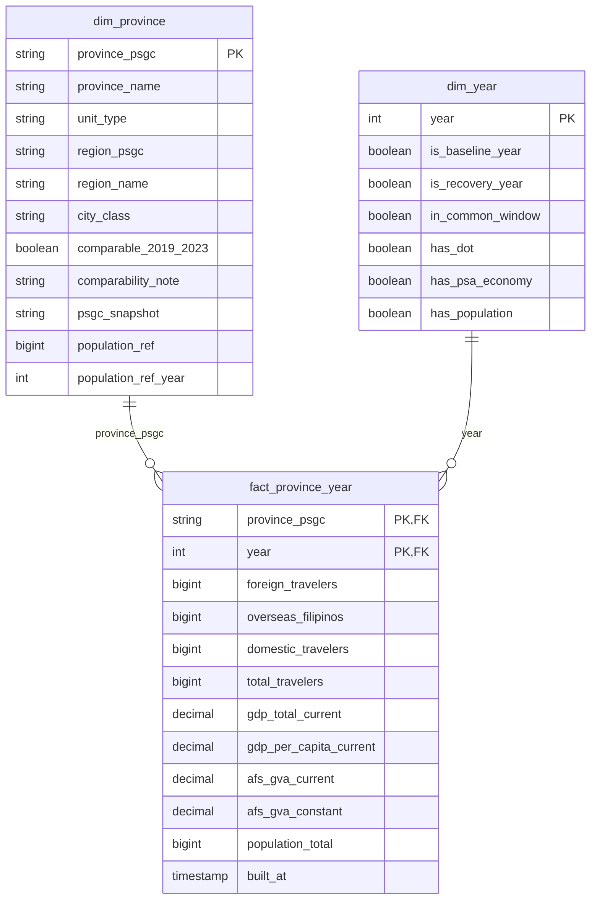

# Province-Level Data Model: Tourism and Local Economy

This document defines the data model that supports the tourism recovery and local-economy business questions (BQ1 and BQ2) at **province level**. It sets out the grain, keys, relationships and important fields of each table; the geographic and temporal compatibility of the sources; the source-to-target mappings; and the decisions taken.

---
## 1. Model overview

Tables in your requested order (key, column name, data type):

markdown
### dim_province

| Key | Column Name | Data Type |
|-----|-------------|-----------|
| PK | province_psgc | string |
| | province_name | string |
| | unit_type | string |
| | region_psgc | string |
| | region_name | string |
| | city_class | string |
| | comparable_2019_2023 | boolean |
| | comparability_note | string |
| | psgc_snapshot | string |
| | population_ref | bigint |
| | population_ref_year | int |

### fact_province_year

| Key | Column Name | Data Type |
|-----|-------------|-----------|
| PK, FK | province_psgc | string |
| PK, FK | year | int |
| | foreign_travelers | bigint |
| | overseas_filipinos | bigint |
| | domestic_travelers | bigint |
| | total_travelers | bigint |
| | gdp_total_current | decimal |
| | gdp_per_capita_current | decimal |
| | afs_gva_current | decimal |
| | afs_gva_constant | decimal |
| | population_total | bigint |
| | built_at | timestamp |

### dim_year

| Key | Column Name | Data Type |
|-----|-------------|-----------|
| PK | year | int |
| | is_baseline_year | boolean |
| | is_recovery_year | boolean |
| | in_common_window | boolean |
| | has_dot | boolean |
| | has_psa_economy | boolean |
| | has_population | boolean |

The model is a star schema with one fact table and two dimensions.

| Table | Purpose |
| --- | --- |
| `fact_province_year` | Tourism, economic and population measures for each province-level unit and year |
| `dim_province` | The province-level unit: Philippine Standard Geographic Code (PSGC), name, region and type |
| `dim_year` | The calendar year and flags identifying the baseline and recovery years |

The PSGC gives every place one stable 10-digit code. DOT and PSA identify places by name only, so reviewed mapping tables (kept outside the star) connect their names to PSGC codes. All sources can then be compared for the same province in the same year.

---

## 2. Selected sources

| Source | Bronze table | Used for |
| --- | --- | --- |
| PSGC 2Q 2026, DS_34 main sheet | `psgc_ds_34_psgc` (43,768 rows) | Authoritative list of places and codes; builds `dim_province` |
| PSGC DS_33 Provincial Summary; DS_34 National Summary | `psgc_ds_33_provincial_summary` (139), `psgc_ds_34_national_summary` (22) | Reconciliation only |
| PSGC report text | `psgc_report_text` | Snapshot label |
| DOT DS_05, overnight travelers 2019 to 2024 | `dot_ds_05_<year>` | Tourism columns |
| PSA DS_27 Total GDP, current prices | `psa_ds_27` | `gdp_total_current` |
| PSA DS_29 Per capita GDP, current prices | `psa_ds_29` | `gdp_per_capita_current` |
| PSA DS_31 A&F GVA, current prices | `psa_ds_31` | `afs_gva_current` |
| PSA DS_32 A&F GVA, constant prices | `psa_ds_32` | `afs_gva_constant` |
| PSA DS_18 Projected mid-year population | `psa_ds_18` | `population_total` |

Not used: the PSGC `Prov Sum` sheet (dated "as of 30 June 2020") and PSA DS_26, DS_28, DS_30, DS_01, DS_02 and DS_08 to DS_17, which no business question requires.

---

## 3. Grain, keys and relationships

| Table | Grain (one row per) | Primary key | Foreign keys |
| --- | --- | --- | --- |
| `fact_province_year` | Province-level unit per year | (`province_psgc`, `year`) | `province_psgc` to `dim_province`; `year` to `dim_year` |
| `dim_province` | Province-level unit | `province_psgc` | none |
| `dim_year` | Calendar year, 2019 to 2025 | `year` | none |

**Relationships.** Each dimension row relates to many fact rows. The fact table joins directly to each dimension; the dimensions do not join to each other.

**Key rules**

1. `province_psgc` holds the PSGC code of the unit (a province code, an HUC city code, or the NCR region code) as 10-character text. Leading zeros are restored where the source has lost them.
2. The 10 digits are structured RR PPP MM BBB: region (digits 1 to 2), province (1 to 5), city or municipality (1 to 7), barangay (1 to 10).
3. The natural PSGC key is used, with no surrogate keys or history tracking, because a single PSGC snapshot applies to all years.
4. The fact table has exactly one row for every unit and every year from 2019 to 2025. A value that no source published is NULL and is never replaced by 0.

---

## 4. Important fields

### 4.1 `dim_province`

| Field | Description |
| --- | --- |
| `province_psgc` | Primary key |
| `province_name` | Official PSGC name |
| `unit_type` | Province, HUC or NCR |
| `region_psgc`, `region_name` | Region derived from the unit |
| `city_class` | HUC, independent component city or component city, where relevant |
| `comparable_2019_2023` | True where the unit has the same meaning in the 2019 and 2023 data |
| `comparability_note` | Reason where the unit is not comparable |
| `psgc_snapshot` | `2Q 2026` |
| `population_ref`, `population_ref_year` | PSGC census population and its census year (reference only) |

### 4.2 `dim_year`

`year`, `is_baseline_year` (2019), `is_recovery_year` (2022, 2023), `in_common_window` (2020 to 2023), `has_dot`, `has_psa_economy`, `has_population`.

### 4.3 `fact_province_year`

| Group | Columns | Source | Additivity |
| --- | --- | --- | --- |
| Tourism | `foreign_travelers`, `overseas_filipinos`, `domestic_travelers`, `total_travelers` | DOT DS_05 | Additive |
| Economy | `gdp_total_current` | PSA DS_27 | Additive |
| | `gdp_per_capita_current` | PSA DS_29 | Non-additive (ratio) |
| | `afs_gva_current`, `afs_gva_constant` | PSA DS_31, DS_32 | Additive within a price basis |
| Population | `population_total` | PSA DS_18 | Additive across provinces, not across years |

The fact table stores base measures only. Ratios are non-additive and are defined once in Gold views over the star:

| Metric | Definition |
| --- | --- |
| Tourism activity | `total_travelers` |
| Tourism intensity | `total_travelers / population_total x 1,000` |
| Concentration | Share of the provincial total per year, rank, top-N share and Herfindahl-Hirschman index |
| Recovery Index | `total_travelers (year) / total_travelers (2019) x 100`, for 2022 and 2023. Below 2019 if < 100; at or above 2019 if >= 100 |
| Segment recovery | Recovery Index for `domestic_travelers`, `foreign_travelers` and `overseas_filipinos` |
| A&F GVA change | `afs_gva_constant (2023) / afs_gva_constant (2019) x 100` |
| Quadrant | Tourism up or down combined with A&F up or down, where up means an index >= 100 |
| Economic significance | `afs_gva_current / gdp_total_current x 100` for the same year |

Views: `vw_tourism_concentration`, `vw_tourism_intensity`, `vw_province_recovery`, `vw_tourism_economy_link`.

---

## 5. Geographic compatibility

| Topic | Treatment |
| --- | --- |
| Unit definition | DOT level-1 rows define the unit: a province or a highly urbanized city (HUC). PSA rows are mapped to the same units. |
| NCR | NCR is a single unit keyed by the NCR region code. Where a source prints NCR by city, the city rows are summed; where it prints an NCR total, that row is used. |
| Boracay | Boracay is printed at DOT level 1 but is a sub-area of Aklan. It is excluded from the fact to avoid double counting. |
| Units changed between 2019 and 2023 | A unit created, split or merged in that period is flagged `comparable_2019_2023 = false` and excluded from the recovery and BQ2 views. |
| Region assignment | Region is taken from the PSGC 2Q 2026 snapshot for all years. |
| PSA hierarchy markers | Leading dots differ in depth between PSA tables. Rows are classified by cleaned name matched to `dim_province`, not by dot depth. |
| Encoding | The Unicode replacement character in PSA names (for example `Las Pi\ufffdas`) is repaired in a cleaned name column. |
| Non-place rows | DOT `GRAND TOTAL` and region rows, and PSA region and national rows, are used for checks only. |
| Name matching | Exact name first, then PSGC `old_names`, then manual review. |

---

## 6. Temporal compatibility

| Source | 2019 | 2020 | 2021 | 2022 | 2023 | 2024 | 2025 |
| --- | :-: | :-: | :-: | :-: | :-: | :-: | :-: |
| DOT overnight travelers | ✓ | ✓ | ✓ | ✓ | ✓ | ✓ | |
| PSA GDP, GDP per capita, A&F GVA (DS_27, DS_29, DS_31, DS_32) | ✓ | ✓ | ✓ | ✓ | ✓ | | |
| PSA projected population (DS_18) | | ✓ | ✓ | ✓ | ✓ | ✓ | ✓ |

- **Geography:** one PSGC snapshot (2Q 2026) applies to all years.
- **Years required:** 2019 (baseline), 2022 and 2023 (recovery), and 2019 to 2023 for BQ2. All are covered by DOT and DS_27 to DS_32. All sources overlap in 2020 to 2023.
- **Population:** DS_18 starts in 2020, so tourism intensity is available from 2020 and covers the recovery years. PSGC population is reference only.
- **Price basis:** growth uses constant prices; shares use current prices. The two are never combined in one ratio.
- **Missing values:** NULL means not published. The only blank treated as zero is the DOT `-` marker.

---

## 7. Source-to-target mappings

Bronze remains as printed. Cleaning and mapping occur in Silver, and the star schema and views are built in Gold.

### 7.1 PSGC to `dim_province`

| Rule | Detail |
| --- | --- |
| Units selected | PSGC rows with geographic level Province; rows with level City and city class HUC; and the NCR region row |
| `province_psgc` | PSGC code of the selected row, as 10-character text |
| `unit_type` | Province, HUC or NCR |
| `region_psgc`, `region_name` | First 2 digits of the code followed by zeros; name looked up from the region row |
| `city_class`, `population_ref`, `population_ref_year` | From the PSGC fields of the same name, with the census year taken from the source header |
| `psgc_snapshot` | From `psgc_report_text` |
| `comparable_2019_2023`, `comparability_note` | Set from the review of the mapping tables |

### 7.2 DOT to fact columns

| Source | Target | Transformation |
| --- | --- | --- |
| `area_label`, `parent_label` where `indent_level = '1'` | `province_psgc` | Trim; join to `map_dot_area_to_psgc`; Boracay is not loaded; NCR rows are summed |
| `source_year` | `year` | Cast to integer |
| `foreign_travelers`, `overseas_filipinos`, `domestic_travelers`, `total_travelers` | Same names | Remove thousands separators; `-` to 0; cast to bigint |

### 7.3 PSA to fact columns

| Source | Target | Transformation |
| --- | --- | --- |
| `psa_ds_27` | `gdp_total_current` | Unpivot year columns; remove thousands separators; cast to decimal |
| `psa_ds_29` | `gdp_per_capita_current` | As above. NCR value is derived as `gdp_total_current / population_total`, using the units held in `ref_indicator` |
| `psa_ds_31` | `afs_gva_current` | As above |
| `psa_ds_32` | `afs_gva_constant` | As above |
| First column (`Provinces`) | `province_psgc` | Join to `map_psa_area_to_psgc` where `row_role` is `province_unit`; `ncr_component` rows are summed; other roles are not loaded |
| Revision suffix (for example `2023r`) | Silver `is_revised` | Separate the suffix from the value |

### 7.4 DS_18 to `population_total`

The multi-level header rows (section, year, Total/Male/Female) are parsed into a column map. Only the Total columns are kept and unpivoted to (`province_psgc`, `year`, `population_total`). Rows are mapped through `map_psa_area_to_psgc` in the same way as the other PSA tables. A unit with no matching row remains NULL.

### 7.5 Mapping and reference tables (Silver, outside the star)

| Table | Grain | Key | Main fields |
| --- | --- | --- | --- |
| `map_dot_area_to_psgc` | Distinct DOT level-1 label and parent label | (`area_label`, `parent_label`) | `province_psgc`, `include_in_province_grain`, `match_method`, `valid_from_year`, `valid_to_year`, `reviewed_by`, `reviewed_on`, `notes` |
| `map_psa_area_to_psgc` | Distinct raw PSA area label per dataset | (`ds_id`, `area_label_raw`) | `area_label_clean`, `row_role` (`province_unit`, `ncr_component`, `region_total`, `national_total`, `other`), `province_psgc`, `match_method`, `valid_from_year`, `valid_to_year`, `reviewed_by`, `reviewed_on`, `notes` |
| `ref_indicator` | Fact column | `column_name` | Units, price basis, base year, source table title |

### 7.6 Validation rules

1. PSGC rows loaded equal the Bronze rows (43,768); `psgc_code` is unique and 10 digits; every non-region place has a parent.
2. PSGC counts of cities, municipalities and barangays per province and region agree with DS_33 and the DS_34 National Summary; differences are listed.
3. Star keys are unique, the fact has one row per unit and year (dimension rows x 7 years), and there are no orphan keys.
4. Every DOT level-1 label and every PSA area label has a defined role; the unmapped count is 0.
5. DOT: traveler groups sum to the total in every row; province-level rows (Boracay excluded) sum to the DOT region totals and the `GRAND TOTAL` for each year.
6. PSA: province-level sums agree with region or national rows within a stated tolerance; differences are listed.
7. For every comparable unit, tourism columns are non-NULL for 2019, 2022 and 2023, and economic columns are non-NULL for 2019 and 2023; failures are listed with the reason.
8. Shares use current-price columns only; growth uses constant-price columns only.

---

## 8. Decisions

| ID | Decision | Rationale |
| --- | --- | --- |
| D1 | The 10-digit PSGC code, stored as text, is the geography key. | Place names are unstable; codes join sources reliably. |
| D2 | The DS_34 main sheet is the authoritative place list. DS_33 and the DS_34 summary sheets are used for reconciliation only. `Prov Sum` is excluded. | One list and one hierarchy; `Prov Sum` is dated 2020. |
| D3 | The province-level unit follows DOT level 1: a province or an HUC. NCR is a single unit. | Matches how DOT reports; NCR has no provinces and PSA prints it by city. |
| D4 | Region is derived from the unit using the PSGC 2Q 2026 assignment and stored in `dim_province`. | Consistent with PR #30; keeps the star free of dimension-to-dimension joins. |
| D5 | One PSGC snapshot applies to all years, with no history tracking. | One consistent geography. |
| D6 | Bronze is kept as printed; cleaning, padding, casting and unpivoting occur in Silver. | Bronze guide and lineage. |
| D7 | Name-to-PSGC mappings are reviewed tables, not fuzzy matching in code. | Every mapping is explainable and signed off. |
| D8 | Boracay is excluded from the fact. | Its total is already counted within Aklan. |
| D9 | Tourism measures come from DOT level-1 rows only, and `-` is treated as 0. | Province grain; the DOT ingestion checks treat `-` as 0. |
| D10 | The model is a star with one fact and two dimensions. Mapping tables and the full PSGC list stay in Silver. | Simple to explain and to query. |
| D11 | NULL means not published and is never 0. The fact has a row for every unit and year from 2019 to 2025. | Keeps gaps visible and the grain complete. |
| D12 | Only the PSA tables required by the business questions are included (DS_18 total, DS_27, DS_29, DS_31, DS_32). | Keeps the model small; later additions only add columns. |
| D13 | PSA rows are classified by cleaned name matched to `dim_province`, not by leading-dot depth. | Dot depth differs between PSA tables. |
| D14 | Ratios are not stored in the fact; they are defined once in Gold views. Growth uses constant prices, shares use current prices, a ratio is NULL where its 2019 base is 0 or missing, and up/down uses a threshold of 100. | Ratios cannot be summed or averaged; one definition serves every question. |
| D15 | `comparable_2019_2023` marks units with the same meaning in 2019 and 2023; recovery and BQ2 views use comparable units only. | A unit created or split since 2019 has no valid baseline. |
| D16 | Per-capita GDP is taken from DS_29 as published. Population comes from DS_18 for the same year, so intensity is available from 2020. PSGC population is reference only. | Published values follow PSA's own method; DS_18 has no 2019 values. |
| D17 | PSA Bronze retains each CSV title row, and units and price basis are recorded in `ref_indicator` and the Gold column comments. | The title row normally holds units and price basis and is currently discarded. |
